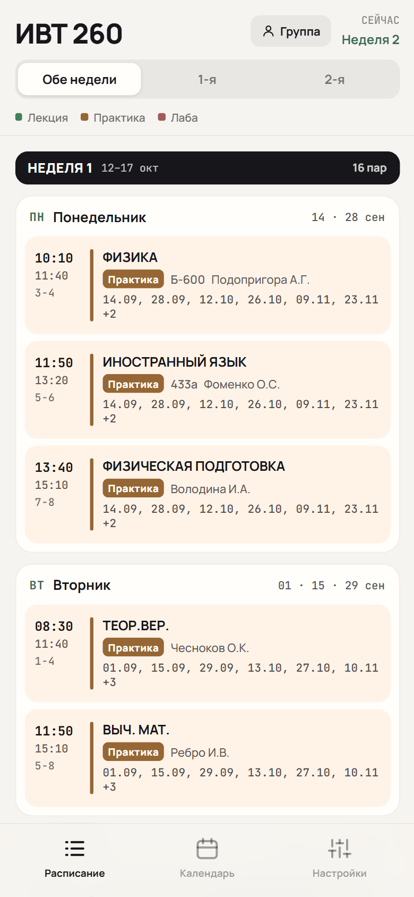
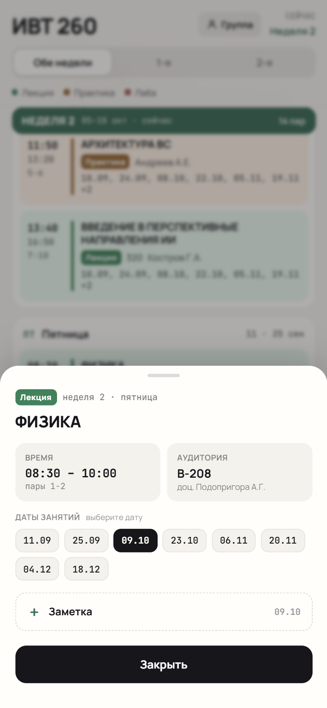
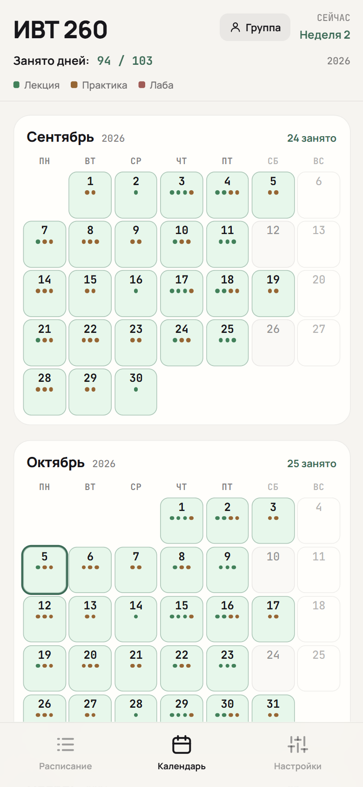
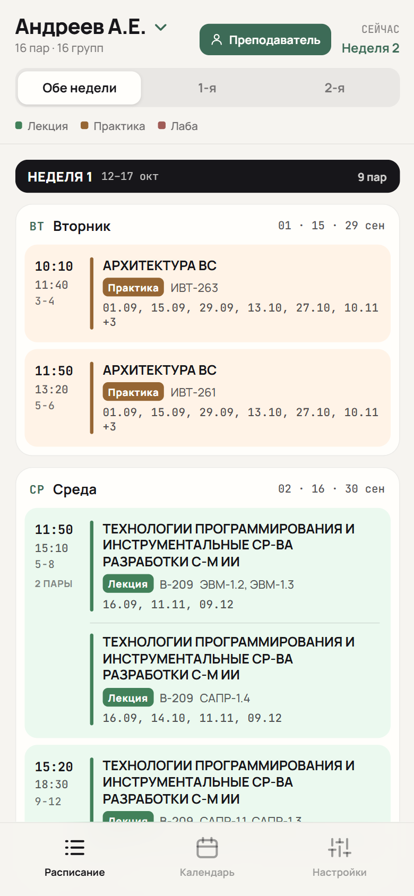
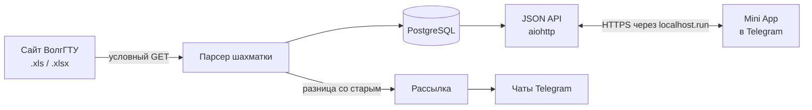

<a name="readme-top"></a>

<div align="center">


# Расписание ВолгГТУ

**Расписание занятий ВолгГТУ прямо в Telegram.**<br>
Бот сам скачивает файлы с сайта университета, разбирает «шахматку» учебного отдела<br>
и показывает пары в Mini App: с датами, календарём, заметками и уведомлениями об изменениях.

[](https://www.python.org/)
[](https://docs.aiogram.dev/)
[](https://docs.aiohttp.org/)
[](https://www.postgresql.org/)
[](docker-compose.yml)
[](https://core.telegram.org/bots/webapps)
[](https://github.com/kuregor/vstuschedulebot/commits)

[Возможности](#-возможности) · [Быстрый старт](#-быстрый-старт) · [Как устроено](#-как-устроено) · [Настройка](#-переменные-окружения) · [Разработка](#-разработка) · [Ограничения](#-ограничения)

</div>

<br>

<table>
  <tr>
    <td align="center"></td>
    <td align="center"></td>
    <td align="center"></td>
    <td align="center"></td>
  </tr>
  <tr>
    <td align="center"><sub><b>Пары на две недели</b></sub></td>
    <td align="center"><sub><b>Все даты и заметки</b></sub></td>
    <td align="center"><sub><b>Календарь семестра</b></sub></td>
    <td align="center"><sub><b>Режим преподавателя</b></sub></td>
  </tr>
</table>

> [!TIP]
> Приложение открывается кнопкой «Открыть расписание» в чате с ботом или кнопкой меню слева от поля ввода.
> Текстом бот расписание не присылает: всё живёт внутри Mini App.

## ✨ Возможности

### 📱 В приложении

- **Пары на две недели.** Числитель и знаменатель рядом: день, время, аудитория, преподаватель и все даты занятия. Переключатель **Обе недели / 1-я / 2-я**.
- **Календарь семестра.** Месяцы с сентября по декабрь: занятые дни залиты, на каждом точки по числу пар в цвете типа занятия. Тап по дате открывает карточку дня.
- **Шторка пары.** Тап по паре показывает детали и полный список дат.
- **Режим преподавателя.** Кнопка **Группа** в шапке открывает выбор преподавателя: сначала те, кто ведёт у группы, а поиском по фамилии или предмету находится любой из всех файлов сайта. Список и календарь показывают его пары во всех группах, на месте преподавателя стоят группы, лекция на поток идёт одной парой. Зелёная кнопка **Преподаватель** или «Назад» в Telegram возвращают к своей группе, а выбранный преподаватель помнится между запусками.
- **Заметки к парам.** В шторке пары выбирается дата, и заметка пишется именно на неё: «принести словарь», «сдать лабу». На датах с заметкой стоит точка, сама заметка видна под парой в списке и в карточке дня. Перезалив файла с сайта заметки не теряет.
- **Напоминания.** Под заметкой выбирается, когда написать в чат: пресетом («за 1 день», «за 3 дня») или вручную календарём и колёсами часов. В назначенное время бот присылает пару, её время, аудиторию и текст заметки.
- **Реальные пары.** В файле учебного отдела две пары иногда делят одно время и идут по очереди, в разные даты. Этот режим (включается в настройках) оставляет в списке только те, что идут на ближайших двух неделях.
- **Настройки помнит бот.** «Реальные пары», открытый преподаватель и заметки хранятся на сервере, а не только на устройстве. Поэтому они одинаковы на телефоне и компьютере и переживают перезапуск бота и смену адреса туннеля.
- **Выбор расписания.** На вкладке **Настройки** выбираются уровень образования, факультет, курс и группа. Курс — это конкретный файл на сайте: приложение просит бота скачать его и показывает, сколько внутри групп и пар и когда он обновлялся.
- **Работа по плохой сети.** Разобранное расписание хранится в `localStorage`, поэтому открывается мгновенно и переживает обрыв связи; у сервера приложение спрашивает только «не изменилось ли» и получает `304`. Статика несёт версию в адресе и отдаётся сжатой, а мост Telegram лежит своей копией в `webapp/`: в России `telegram.org` замедляют, и без копии приложение не стартовало бы.

### 🤖 В боте

- **Вход в приложение.** `/start` и `/app` присылают кнопку «Открыть расписание» и поправляют кнопку меню. Когда адрес приложения меняется, бот сам переводит на новый и кнопку меню, и кнопки под своими последними сообщениями — нажимать `/start` после перезапуска не нужно.
- **Уведомления об изменениях.** Когда учебный отдел перевыкладывает файл, бот сравнивает новое расписание группы с прежним и пишет тем, у кого эта группа выбрана: что добавилось, что убрали, где сменились аудитория, преподаватель, тип занятия, время или даты («перенос 13.10 → 20.10»). Отключается в настройках приложения.
- **Обновление без участия человека.** При старте бот докачивает недостающие файлы каталога: 7 дневных факультетов бакалавриата (ФАСТиВ, ФАТ, ФТКМ, ФТПП, ФЭУ, ФЭВТ, ХТФ) и магистратуру, поэтому группы видны сразу. Дальше раз в `SCHEDULE_REFRESH_HOURS` часов он сверяет каждый файл с сайтом условным запросом: пока файл не менялся, сайт отвечает `304` без тела, и весь каталог обходится за пару секунд.

<details>
<summary><b>Как бот не шлёт ложных тревог</b></summary>
<br>

Даты сравниваются осторожно: только будущие, только прочитанные из файла (расчёт по чётности недели держится на границах семестра, а не на расписании) и только если правила их расчёта с прошлого импорта не менялись. Если «переехала» половина пар группы разом, это считается пересчётом, а не правкой, и сообщение не уходит.

Пустому разбору бот тоже не верит. Файл без единой пары отвергается целиком, а группа, получившая 0 пар при прежних парах, сохраняет старое расписание — иначе пустой шаблон на сайте разослал бы всем «пара убрана».

</details>

## 🚀 Быстрый старт

> [!NOTE]
> Понадобятся [Docker Desktop](https://www.docker.com/products/docker-desktop/) (на Windows — с WSL 2 и включённой виртуализацией) и токен бота от [@BotFather](https://t.me/BotFather).

**1. Скачайте проект**

```bash
git clone https://github.com/kuregor/vstuschedulebot.git
cd vstuschedulebot
```

**2. Заполните настройки.** Скопируйте образец и впишите в `.env` токен бота. Обязательна только переменная `BOT_TOKEN`, остальное работает как есть.

```bash
cp .env.example .env
```

В `cmd` то же самое делает `copy .env.example .env`.

**3. Поднимите стек**

```bash
docker compose up -d --build
```

**4. Проверьте.** Бот готов, когда `docker compose ps` показывает у него `healthy`, а в логах есть строка «Бот запущен». После этого `/start` в Telegram открывает расписание.

```bash
docker compose logs -f bot
```

Таблицы создаются сами при первом запуске, а на пустой базе бот сам скачает весь каталог сайта — около 45 файлов.

| контейнер | что делает | наружу |
| --- | --- | --- |
| `schedule-db` | PostgreSQL 18, данные в томе `vstu-pgdata` | `127.0.0.1:5433` |
| `schedule-bot` | бот и веб-сервер Mini App в одном процессе | `127.0.0.1:7070` |
| `schedule-tunnel` | публичный HTTPS-адрес через localhost.run | — |

> [!IMPORTANT]
> После правок в `bot/` или `webapp/` нужна именно пересборка: `docker compose up -d --build bot`. Код копируется внутрь образа, и `docker compose restart` поднимет старую версию.

<details>
<summary><b>Шпаргалка по командам</b></summary>
<br>

```bash
docker compose logs -f bot                                # логи бота
docker compose ps                                         # что запущено
docker exec -it schedule-db psql -U schedule -d schedule  # консоль psql
docker compose down                                       # остановить, данные остаются
```

`docker compose down -v` удаляет стек вместе с томом базы. После этого бот заново скачает с сайта весь каталог, а заметки и настройки пользователей пропадут.

</details>

<p align="right"><a href="#readme-top">↑ наверх</a></p>

## 🧭 Как устроено



Один контейнер `schedule-bot` держит и бота, и веб-сервер Mini App: статика из `webapp/` отдаётся тем же процессом. Рядом с ними работают три фоновые задачи — следят за адресом туннеля, сверяют расписания с сайтом и разносят уведомления с напоминаниями. Падение одной задачи остальные не останавливает.

| слой | чем сделано |
| --- | --- |
| бот | Python 3.13, aiogram 3 |
| веб-сервер Mini App | aiohttp, в том же процессе, что и бот |
| хранение | PostgreSQL 18, SQLAlchemy 2 (asyncio) и asyncpg |
| парсер расписаний | xlrd для `.xls` и openpyxl для `.xlsx` |
| приложение | HTML, CSS и JS без сборки, Telegram Web App |
| запуск | Docker Compose и SSH-туннель до публичного HTTPS |

Как устроен разбор шахматки, откуда берутся даты занятий и по каким признакам определяется лекция, практика или лаба, расписано в комментариях модулей [`bot/parsing/`](bot/parsing): `vstu_xls.py`, `dates.py`, `classify.py`.

## 🌐 Публичный адрес Mini App

> [!NOTE]
> Telegram открывает Mini App только по HTTPS, поэтому `http://localhost` не подойдёт. Для этого в стеке есть туннель.

Профиль `lhr` (значение по умолчанию в `COMPOSE_PROFILES`) поднимает SSH-реверс до [localhost.run](https://localhost.run): ни домена, ни аккаунта, ни установки.

Адрес такого туннеля меняется, поэтому руками он не прописывается. Туннель пишет выданный адрес в общий том, бот читает его оттуда и сам переставляет кнопку меню — общую и каждому, кто уже писал боту, — и правит кнопки под своими последними сообщениями в каждом чате. Поэтому `WEBAPP_URL` в `.env` остаётся пустым: заданный явно адрес главнее файла. Посмотреть текущий:

```bash
docker compose logs tunnel | grep lhr.life
```

В `cmd` вместо `grep` — `findstr`.

SSH-ключ, зарегистрированный на <https://admin.localhost.run/> и положенный в `secrets/lhr_ed25519`, держит поддомен между переподключениями, но постоянным его не делает: бесплатные адреса localhost.run всё равно меняются. Cloudflare Tunnel как альтернатива не поддерживается — часть российских провайдеров обрывает с ним TLS-рукопожатие.

## 🔧 Переменные окружения

Образец со всеми переменными и пояснениями — [`.env.example`](.env.example).

| переменная | по умолчанию | назначение |
| --- | --- | --- |
| `BOT_TOKEN` | — | токен бота от @BotFather, **обязателен** |
| `COMPOSE_PROFILES` | `lhr` | профиль туннеля, оставить `lhr` |
| `WEBAPP_URL` | пусто | постоянный адрес приложения, только `https://`; пустой — брать из файла туннеля |
| `WEBAPP_URL_FILE` | `/state/url` | откуда читать адрес туннеля |
| `DATABASE_URL` | `…@localhost:5433/schedule` | строка подключения; в Docker задаётся из `docker-compose.yml` |
| `POSTGRES_PASSWORD` | `schedule` | пароль базы для `db` и для строки подключения бота в compose |
| `SCHEDULE_REFRESH_HOURS` | `6` | как часто сверять расписания с сайтом, в часах (минимум 1) |
| `SEMESTER_START`, `SEMESTER_END` | `2026-09-01`, `2026-12-29` | границы семестра: по ним считаются даты занятий и месяцы календаря |
| `WEBAPP_HOST`, `WEBAPP_PORT` | `0.0.0.0`, `7070` | сокет веб-сервера приложения |
| `WEBAPP_ALLOW_INSECURE` | `0` | `1` — открывать приложение без подписи Telegram, только для [отладки](#-разработка) |

Ошибки в `.env` всплывают сразу. Кривая дата, начало семестра позже конца, семестр длиннее 400 дней или не число в `WEBAPP_PORT` и `SCHEDULE_REFRESH_HOURS` — бот не стартует и говорит, какая переменная неверна.

<p align="right"><a href="#readme-top">↑ наверх</a></p>

## 🧪 Разработка

Тесты парсера, дат, каталога сайта, API, сравнения расписаний, преподавателей и кнопок, плюс регрессии найденных багов:

```bash
python -m pytest tests -q
```

Тесты с настоящим PostgreSQL (`tests/test_webapp_fixes_db.py`) без `TEST_DATABASE_URL` пропускаются. Им нужна отдельная база с `test` в имени: таблицы там пересоздаются.

Разобрать файл расписания без бота и базы — скрипт печатает группы, занятия с рассчитанными датами и предупреждения:

```bash
python scripts/parse_preview.py "ОН_Магистратура_1 курс ФЭВТ.xls"
```

Вёрстку удобно смотреть в обычном браузере: `WEBAPP_ALLOW_INSECURE=1` открывает приложение по `http://localhost:7070` без подписи Telegram.

> [!WARNING]
> Включайте `WEBAPP_ALLOW_INSECURE=1` только при остановленном туннеле (`docker compose stop tunnel`). Иначе API без проверки подписи окажется доступен всем по публичному адресу.

<details>
<summary><b>Запуск без Docker</b></summary>
<br>

Понадобится PostgreSQL — проще всего поднять только базу: `docker compose up -d db`. Бот запускается модулем, именно через `-m`: `bot` — пакет с относительными импортами.

```bash
python -m venv .venv
source .venv/bin/activate        # Windows: .venv\Scripts\activate
pip install -r requirements.txt
python -m bot.main
```

Одна команда поднимает и бота, и веб-сервер приложения. Публичный адрес всё равно нужен, а туннель из compose смотрит внутрь своей сети, поэтому пробросьте порт сами:

```bash
ssh -R 80:localhost:7070 nokey@localhost.run
```

</details>

### 📁 Структура проекта

```
bot/
  main.py          запуск бота, веб-сервера и трёх фоновых задач
  config.py        настройки из .env, проверяются при старте
  handlers/        /start и /app — кнопка, открывающая Mini App
  db/              модели и сессия
  parsing/         разбор шахматки: книга, сетка, роли ячеек, типы занятий, даты
  services/        каталог сайта, импорт, сравнение, рассылка, заметки,
                   преподаватели, кнопки приложения, выборки для API
  webapp/          aiohttp: статика, JSON API, подпись Telegram, адрес приложения
  utils/           подписи дней и месяцев, чётность недели, склонение «пар»
webapp/            Mini App: index.html, app.css, app.js и копия моста Telegram
scripts/           parse_preview.py (разбор файла), tunnel.sh (туннель)
tests/             тесты и регрессии найденных багов
Dockerfile         образ бота вместе с Mini App
docker-compose.yml база, бот и туннель
```

## 🚧 Ограничения

- Тип занятия в исходном файле почти нигде не подписан и вычисляется по структуре расписания, поэтому редкие ошибки возможны.
- Опечатки в файле учебного отдела бот не исправляет, но отмечает предупреждением: их видно в строке «Курс» на экране настроек.
- Повторный импорт того же файла **перезаписывает** занятия затронутых групп.
- Каталог сайта разбирается регулярными выражениями: если страницу расписаний переверстают, список файлов придётся поправить в `bot/services/vstu_site.py`.
- Поддерживается только обычная сетка учебных занятий — расписания сессии и практик отдельными форматами не разбираются.
- Аспирантура и вечерние факультеты в каталог не попадают.
- Кнопки «Открыть» рядом с ботом в списке чатов нет. Это Main Mini App: он включается только в @BotFather со статичным адресом, а бесплатный адрес localhost.run регулярно меняется. Кнопка появится вместе с постоянным адресом.

## 🤝 Участие

Нашли ошибку в расписании или в приложении — [откройте issue](https://github.com/kuregor/vstuschedulebot/issues) и укажите группу, дату и что ожидали увидеть. Pull request'ы приветствуются; перед отправкой прогоните тесты.

---

<div align="center">

<sub>Расписания берутся с <a href="https://www.vstu.ru/student/raspisaniya/zanyatiy/">сайта ВолгГТУ</a> и обновляются сами.</sub>

<a href="#readme-top">↑ наверх</a>

</div>
